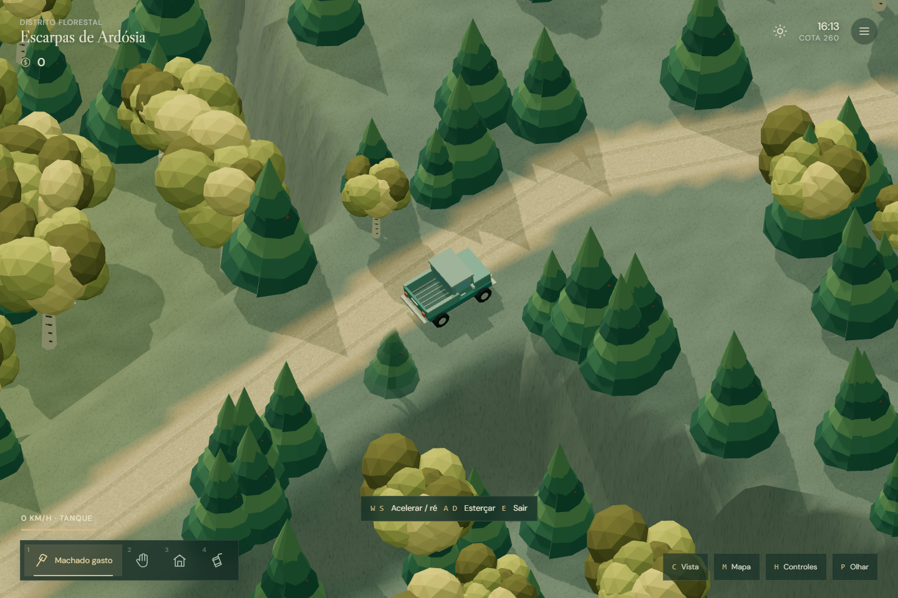

# Woodventure

Um sandbox de exploração, madeira e construção para navegador. Comece com um terreno vazio e um machado gasto; corte árvores, transporte toras, compre equipamentos e encontre caminhos pelas terras altas.



## Jogar

Baixe [JOGAR.html](https://github.com/erereck/woodventure/raw/refs/heads/main/JOGAR.html) e abra no navegador. O arquivo inclui código, fontes e sons procedurais, e funciona offline. Requer WebGL 2; recomendado computador com teclado e mouse.

- **WASD**: caminhar; no carro, acelerar e esterçar.
- **Clique / Espaço**: cortar madeira.
- **Botão direito**: carregar e arrastar objetos.
- **E**: interagir, comprar no balcão e reparar travessias com tábuas entregues.
- **R**: prender ou soltar a carga.
- **X**: abrir caixas e instalar equipamentos no lote.
- **M**: atlas com zoom, exploração e anotações.
- **H**: todos os controles.

O mundo salva no navegador. O menu permite exportar e importar uma cópia. Saves das versões anteriores continuam compatíveis.

## Executar o projeto

Node.js 22.12+.

```sh
npm ci
npm run dev
```

Abra http://127.0.0.1:4173.

```sh
npm test
npm run build
```

O build gera um único `dist/index.html`. Para atualizar a edição portátil, copie esse arquivo para `JOGAR.html`.

## O protótipo

- Nove regiões em um território de 23.040 × 18.432 unidades, floresta por setores e três áreas elevadas.
- Madeira física, caminhonete, refinadora, construção, compras por entrega e dinamite transportável.
- Atlas derivado dos mesmos dados que definem terreno, estradas e pontos de interesse.
- Three.js, Matter.js, TypeScript e Vite. A simulação independe do renderer e tem uma interface de comandos preparada para evolução futura; multiplayer ainda não está implementado.

[Guia completo](LEIA-ME.md) · [Arquitetura](ARQUITETURA.md) · [Direção do jogo](DIRECAO.md) · [Verificação](VERIFICACAO.md)

Protótipo original inspirado no ritmo e na logística de Lumber Tycoon 2; não utiliza seus assets ou código. Licenças das dependências e fontes em [licenses](licenses).
